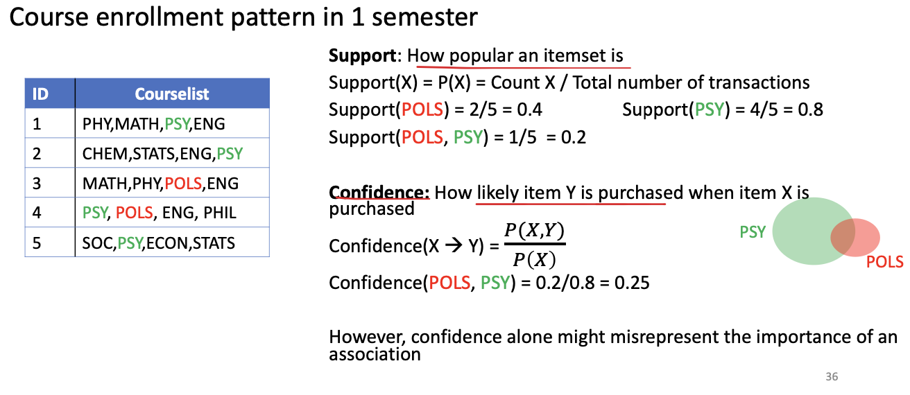
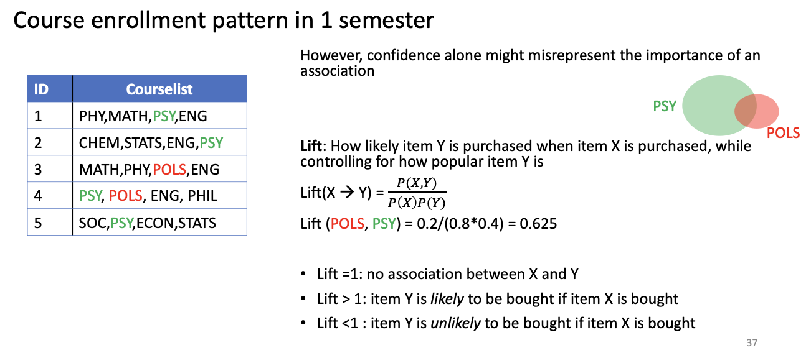
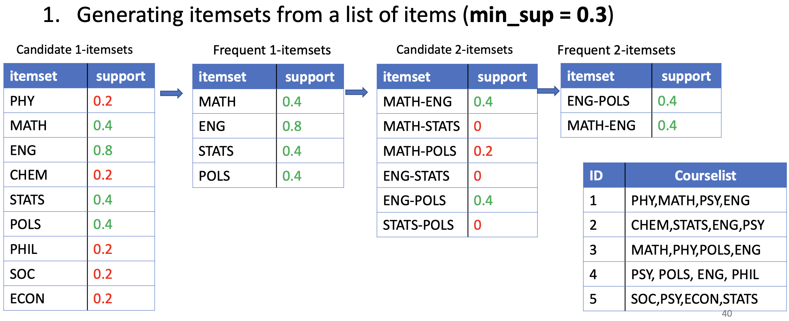

# Lecture 3: Association rules and frequent sequence mining

Quan Nguyen, Department of Statistics, University of British Columbia

## 1. Introduction to association rules mining

Association rules look for combination of items that frequently occur together in transactions (a.k.a. frequent set items). For example, retail basket analysis is one of the most common applications of association rules. By finding frequent itemsets, retailers could understand what is commonly bought together and use this information to increase sales in various ways (e.g., place frequently bought together items next to each other in a store).

| Transaction_ID | items               |
|----------------|---------------------|
| 1              | milk, bread         |
| 2              | bread, butter       |
| 3              | beer, avocado, pizza|
| 4              | milk, bread, butter |
| 5              | bread, butter       |


**What is an example of a frequent itemset from the table above?**

**How can association rules be applied in education?**

If we take the analogy of a market basket analysis, each student is a 'customer' and in each semester, they will make a 'transaction' by enrolling in a set of courses. The data will often take the forms of `term_ID`,`student_ID`, and `course_ID`. 

| term_ID | student_ID | course_ID |
|---------|------------|-----------|
| 1       | Quan       | STAT_101  |
| 1       | Quan       | PSY_101   |
| 1       | Quan       | ECON_101  |
| 2       | Quan       | STAT_201  |
| 2       | Quan       | CS_101    |
| 2       | Quan       | POL_101   |
| 1       | Chris      | CS_101    |
| 1       | Chris      | MATH_101  |
| 1       | Chris      | PSY_101   |
| 2       | Chris      | CS_201    |
| 2       | Chris      | STAT_101  |

Similar data but in a different format

| term_ID | student_ID | transaction_ID | course_ID_set               |
|---------|------------|----------------|-----------------------------|
| 1       | Quan       | 1              | STAT_101, PSY_101, ECON_101 |
| 2       | Quan       | 2              | STAT_201, CS_101, POL_101   |
| 1       | Chris      | 3              | CS_101, MATH_101, PSY_101   |
| 2       | Chris      | 4              | CS_201, STAT_101            |

Using the information available in the Student Information Systems (SIS), we can answer research questions such as:

- Which set of courses are often taken together? -> A-priori algorithm
- Which set of courses are often taken following a set of courses? -> SPADE algorithm

**What are the limitations of association rules**?

Note that association rules only focus on the most frequent (popular) items, and it misses out all the information that are present in the "long tail" of user preference that are essential to provide customized recommendations to customers/users. In such scenarioes, other recommender systems such as collaborative filtering (i.e. recommendations based on user similarity) or content-based filtering (i.e., recommendations based on item similarity) will help detect customers with similar interests even if the absolute number of transactions is small (e.g., customer who are interested in a niche category). 

```{r}
library(tidyverse)
library(arules)
library(arulesViz)
library(arulesSequences)
```

Let's create a sythetic dataset

```{r}
df <- data.frame(matrix(ncol = 2, nrow = 1000))
colnames(df) <- c("id","course")

set.seed(123)
df$id <- sample(x=1:250,1000,replace = T)

set.seed(123)
df$course <- sample(x=c("PSY","MATH","STATS","ECON","PHY","ENG","POLS","BIO","CHEM"),1000,replace=T)

df <- df %>% distinct() %>% arrange(id)
head(df)
```

Let's transform this data frame into transaction format

```{r}
df <- df %>% group_by(id) %>% 
  summarise(courselist = paste0(course, collapse = ","),count = n())
head(df)
```

```{r}
# convert to transaction data object
df$courselist <- as.factor(df$courselist)

# export to csv
write.csv(df$courselist,"course.csv", row.names = FALSE, col.names = FALSE, quote = FALSE)

# read in the csv file
df_obj <- read.transactions('course.csv', format = 'basket', sep=',')
df_obj
```

## 2. Association measures

### Support

The `support` metric tells us how popular a set of items is relative to the total number of transactions


```{r}
itemFrequencyPlot(df_obj,topN=20,type="relative", main="Relative Item Frequency Plot")
```

### Confidence

The `confidence` metric tells us how likely an item Y is purchased given item X is purchased. 

confidence = P(X,Y) / P(X)



Note that the confidence measure might misrepresent the importance of an association. This is because it only accounts for how popular item X is (in our case PSY) but not Y (in our case POLS).

If beer is also very popular in general, there will be a higher chance that a transaction containing PSY will also contain POLS, thus inflating the confidence measure. To account for the base popularity of both items, we use a third measure called lift.

### Lift

Lift tells us how likely item Y is purchased when item X is purchased, while controlling for how popular items Y and X are



- lift = 1: implies no association between items.

- lift > 1: greater than 1 means that item Y is likely to be bought if item X is bought,

- lift < 1: less than 1 means that item Y is unlikely to be bought if item X is bought.

## 3. A-priori algorithm with `arules`



```{r}
association.rules <- apriori(df_obj, parameter = list(supp=0.02, conf=0.6,maxlen=6))
```

```{r}
inspect(association.rules[1:10])
```

```{r}
MATH => CHEM support
```

```{r}
# Finding Rules related to given items

# Find what students enrolled before choosing 'ECON'
item.association.rules <- apriori(df_obj, parameter = list(supp=0.02, conf=0.6),
                                  appearance = list(default="lhs",rhs="ECON"))
```

```{r}
inspect(head(item.association.rules))
```

```{r}
# Find what students enrolled after choosing 'MATH' and 'PHY'
item2.association.rules <- apriori(df_obj, parameter = list(supp=0.02, conf=0.6),
                                   appearance = list(default="rhs",lhs=c("MATH","PHY")))

inspect(head(item2.association.rules))
```

```{r}
plot(association.rules, engine = "plotly")
```

There is a special value for shading called “order” which produces a two-key plot where the color of the points represents the length (order) 

```{r}
plot(association.rules,method="two-key plot", engine = "plotly")
```

Graph-based techniques concentrate on the relationship between individual items in the rule set. They represent the rules (or itemsets) as a graph with items as labeled vertices, and rules (or itemsets) represented as vertices connected to items using arrows.

For rules, the LHS items are connected with arrows pointing to the vertex representing the rule and the RHS has an arrow pointing to the item.


```{r}
plot(association.rules, method = "graph",  engine = "htmlwidget")
```

```{r}
# Parallel plot
plot(association.rules, method="paracoord")
```

Let's try a-priori with different levels of support

```{r}
# Support and confidence values
supportLevels <- c(0.1, 0.05, 0.01, 0.005)
confidenceLevels <- c(0.9, 0.8, 0.7, 0.6, 0.5, 0.4, 0.3, 0.2, 0.1)

# Empty integers 
rules_sup10 <- integer(length=9)
rules_sup5 <- integer(length=9)
rules_sup1 <- integer(length=9)
rules_sup0.5 <- integer(length=9)

# Apriori algorithm with a support level of 10%
for (i in 1:length(confidenceLevels)) {
  
  rules_sup10[i] <- length(apriori(df_obj, parameter=list(sup=supportLevels[1], 
                                   conf=confidenceLevels[i], target="rules")))
  
}

# Apriori algorithm with a support level of 5%
for (i in 1:length(confidenceLevels)){
  
  rules_sup5[i] <- length(apriori(df_obj, parameter=list(sup=supportLevels[2], 
                                  conf=confidenceLevels[i], target="rules")))
  
}

# Apriori algorithm with a support level of 1%
for (i in 1:length(confidenceLevels)){
  
  rules_sup1[i] <- length(apriori(df_obj, parameter=list(sup=supportLevels[3], 
                                  conf=confidenceLevels[i], target="rules")))
  
}

# Apriori algorithm with a support level of 0.5%
for (i in 1:length(confidenceLevels)){
  
  rules_sup0.5[i] <- length(apriori(df_obj, parameter=list(sup=supportLevels[4], 
                                    conf=confidenceLevels[i], target="rules")))
  
}
```

```{r}
# Number of rules found with a support level of 10%
plot1 <- qplot(confidenceLevels, rules_sup10, geom=c("point", "line"), 
               xlab="Confidence level", ylab="Number of rules found", 
               main="Apriori with a support level of 10%") +
  theme_bw()

# Number of rules found with a support level of 5%
plot2 <- qplot(confidenceLevels, rules_sup5, geom=c("point", "line"), 
               xlab="Confidence level", ylab="Number of rules found", 
               main="Apriori with a support level of 5%") + 
  scale_y_continuous(breaks=seq(0, 10, 2)) +
  theme_bw()

# Number of rules found with a support level of 1%
plot3 <- qplot(confidenceLevels, rules_sup1, geom=c("point", "line"), 
               xlab="Confidence level", ylab="Number of rules found", 
               main="Apriori with a support level of 1%") + 
  scale_y_continuous(breaks=seq(0, 50, 10)) +
  theme_bw()

# Number of rules found with a support level of 0.5%
plot4 <- qplot(confidenceLevels, rules_sup0.5, geom=c("point", "line"), 
               xlab="Confidence level", ylab="Number of rules found", 
               main="Apriori with a support level of 0.5%") + 
  scale_y_continuous(breaks=seq(0, 130, 20)) +
  theme_bw()

# Subplot
library(gridExtra)
library(grid)
grid.arrange(plot1, plot2, plot3, plot4, ncol=2)
```

```{r}
# Data frame
num_rules <- data.frame(rules_sup10, rules_sup5, rules_sup1, rules_sup0.5, confidenceLevels)

# Number of rules found with a support level of 10%, 5%, 1% and 0.5%
ggplot(data=num_rules, aes(x=confidenceLevels)) +
  
  # Plot line and points (support level of 10%)
  geom_line(aes(y=rules_sup10, colour="Support level of 10%")) + 
  geom_point(aes(y=rules_sup10, colour="Support level of 10%")) +
  
  # Plot line and points (support level of 5%)
  geom_line(aes(y=rules_sup5, colour="Support level of 5%")) +
  geom_point(aes(y=rules_sup5, colour="Support level of 5%")) +
  
  # Plot line and points (support level of 1%)
  geom_line(aes(y=rules_sup1, colour="Support level of 1%")) + 
  geom_point(aes(y=rules_sup1, colour="Support level of 1%")) +
  
  # Plot line and points (support level of 0.5%)
  geom_line(aes(y=rules_sup0.5, colour="Support level of 0.5%")) +
  geom_point(aes(y=rules_sup0.5, colour="Support level of 0.5%")) +
  
  # Labs and theme
  labs(x="Confidence levels", y="Number of rules found", 
       title="Apriori algorithm with different support levels") +
  theme_bw() +
  theme(legend.title=element_blank())
```

```{r}
df
```

## 4. cSPADE algorithm with `arulesSequences`

Frequent Sequence Mining is used to discover a set of patterns shared among objects which have between them a specific order. For instance, students could enroll in multiple courses over different semester. In this case, we may use Frequent Sequence Mining to find that 40% of the students who enrolled in the STAT101 in term 1, continued to enroll in STAT 201 in term 2. 


```{r}
# create data semester 1
dt1 <- data.frame(matrix(ncol = 2, nrow = 1000))
colnames(dt1) <- c("sequenceID","item")

set.seed(123)
dt1$sequenceID <- sample(x=1:250,1000,replace = T)

set.seed(123)
dt1$item <- sample(x=c("PSY","MATH","STATS","ECON"),1000,replace=T)

dt1$eventID <- 1
dt1 <- unique(dt1)

# create data semester 2
dt2 <- data.frame(matrix(ncol = 2, nrow = 1000))
colnames(dt2) <- c("sequenceID","item")

set.seed(123)
dt2$sequenceID <- sample(x=1:250,1000,replace = T)

set.seed(123)
dt2$item <- sample(x=c("STATS","ECON","PHY","ENG","POLS"),1000,replace=T)

dt2$eventID <- 2
dt2 <- unique(dt2)

# # create data semester 3
dt3 <- data.frame(matrix(ncol = 2, nrow = 1000))
colnames(dt3) <- c("sequenceID","item")

set.seed(123)
dt3$sequenceID <- sample(x=1:250,1000,replace = T)

set.seed(123)
dt3$item <- sample(x=c("PHY","ENG","POLS","BIO","CHEM"),1000,replace=T)

dt3$eventID <- 3
dt3 <- unique(dt3)


dt <- rbind(dt1,dt2,dt3)
dt <- dt %>% arrange(sequenceID, eventID)
head(dt)
```

```{r}
dt <- dt %>% group_by(sequenceID, eventID) %>% 
  summarise(item = paste0(item, collapse = ","),size = n())

dt <- dt %>% select(sequenceID,eventID,size,item)
head(dt)
```

```{r}
library(arulesSequences)
write.table(dt, "course_term.csv", sep=";", row.names = FALSE, col.names = FALSE, quote = FALSE)
trans_matrix <- read_baskets("course_term.csv", sep = ";", info = c("sequenceID","eventID", "size"))
summary(trans_matrix)
```

```{r}
# Get frequent sequences and corresponding support values
s1 <- cspade(trans_matrix, parameter = list(support = 0.02), control = list(verbose = F))
s1.df <- as(s1, "data.frame")
summary(s1)
inspect(head(s1))
```

```{r}
#Convert Back to DS
itemsets_df <- as(s1, "data.frame") %>% as_tibble()
library(tidyverse)
#Top 10 Frequent Item Sets
itemsets_df %>%
  slice_max(support, n = 10) %>% 
  ggplot(aes(x = fct_reorder(sequence, support),
                    y = support,
                    fill = sequence)) + 
    geom_col() + 
    geom_label(aes(label = support %>% scales::percent()), hjust = 0.5) + 
    labs(x = "Site", y = "Support", title = "Most Frequently Visited Item Sets",
         caption = "**Support** is the percent of segments the contain the item set") + 
    scale_fill_discrete(guide = F) +
    scale_y_continuous(labels = scales::percent,
                       expand = expansion(mult = c(0, .1))) + 
    coord_flip() + 
    cowplot::theme_cowplot() 
```

```{r}
rules <- ruleInduction(s1, 
                       confidence = 0.01, 
                       control = list(verbose = FALSE))

inspect(head(rules, 5))
```

```{r}
rules_cleaned <- rules[!is.redundant(rules)]
rules_df <- as(rules_cleaned, "data.frame") %>% 
  as_tibble() %>% 
  separate(col = rule, into = c('lhs', 'rhs'), sep = " => ", remove = F)

rules_df %>% 
  arrange(-confidence) %>% 
  select(lhs, rhs, support, confidence, lift) %>% 
  head() %>% 
  knitr::kable()
```

